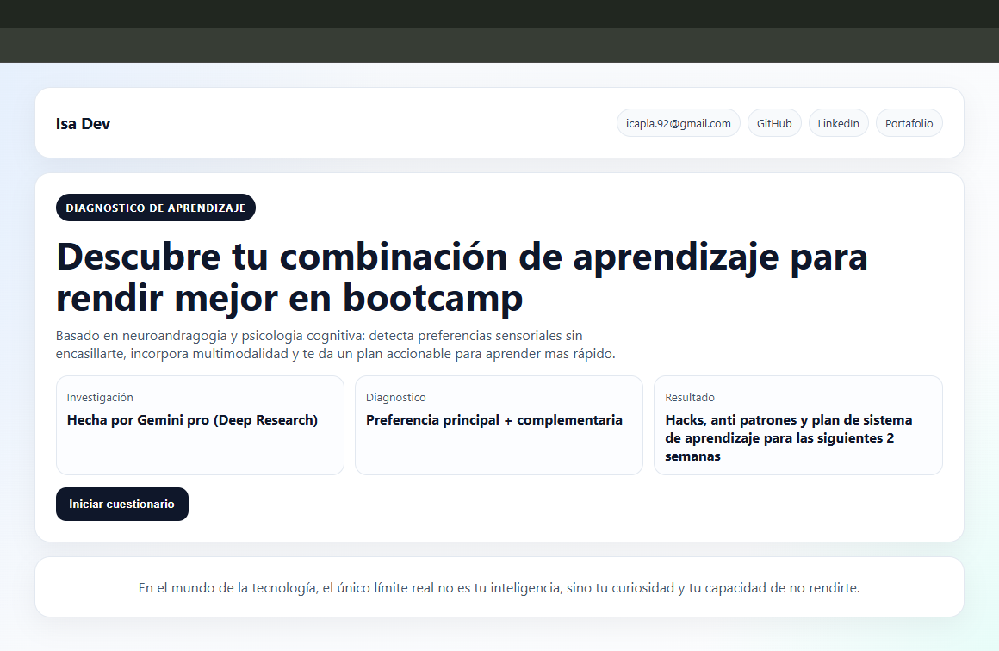

# Diagnostico de Aprendizaje para Bootcamp

Aplicacion web interactiva para identificar la combinacion de aprendizaje predominante de estudiantes (Visual, Auditivo, Lectura/Escritura y Practico/Kinestesico), con recomendaciones personalizadas y habitos de estudio basados en evidencia.



## Que incluye

- Pantalla de bienvenida tipo onboarding.
- Cuestionario diagnostico.
- Resultados con barras de perfil.
- Hacks personalizados por perfil.
- Habitos universales de alto impacto.
- Enlaces de contacto (correo, GitHub, LinkedIn y Portafolio).
- Boton al documento de investigacion.

## Archivos principales

- `index.html`: version funcional para abrir directo con Live Server.
- `app.tsx`: version React/TypeScript del componente principal.
- `estudio.md`: base de investigacion utilizada para personalizacion de contenido.
- `components/ui/*`: componentes UI minimos (`Card`, `Button`, `Badge`, `Progress`).
- `tsconfig.json`: configuracion de TypeScript con alias `@/*`.

## Uso rapido (Live Server)

1. Abre la carpeta del proyecto en VS Code.
2. Ejecuta `Open with Live Server` sobre `index.html`.
3. Navega el flujo: bienvenida -> encuesta -> resultados.

## TypeScript (validacion)

Ejecuta:

```bash
npm run typecheck
```


